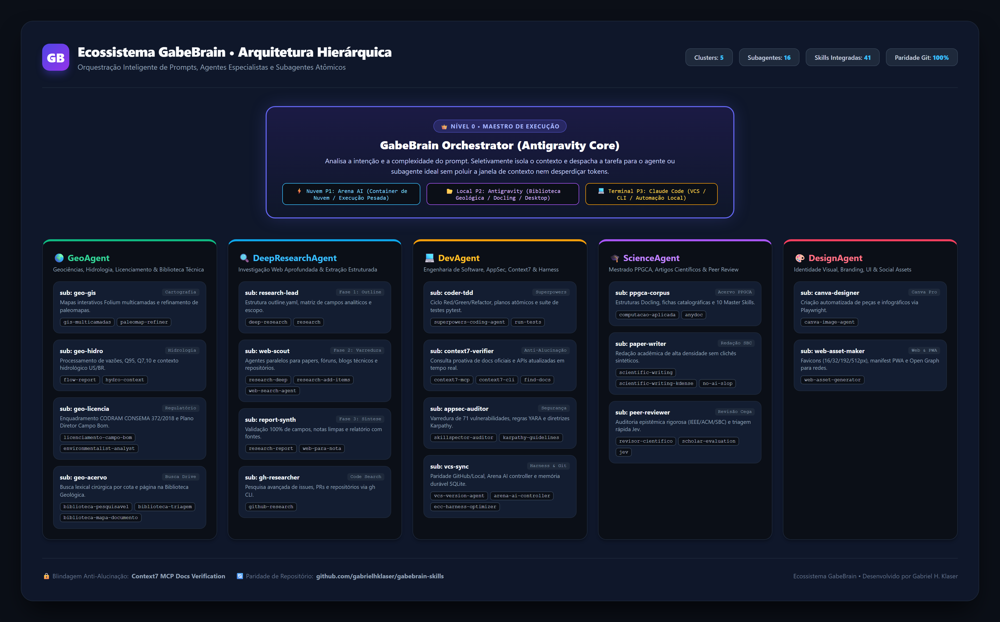

# Diretrizes Operacionais do GabeBrain para Agentes de IA

Bem-vindo ao **GabeBrain Skills & Agents Hub**, o repositório central de inteligência, Master Skills e personas especializadas do ecossistema de Gabriel (@gabrielhklaser).

---

## 🏛️ Papéis e Arquitetura Híbrida: Antigravity x Arena AI

### 1. Arena AI (Motor de Execução em Nuvem - Zero Custo de Tokens Locais)
- **Papel:** Executor de tarefas completas, escrita de código, criação de suítes de testes, refatoração profunda, processamento de dados e geração de artefatos.
- **Funcionamento:** O agente no Arena AI lê os repositórios diretamente via integração GitHub, carrega as Master Skills deste repositório e executa todo o fluxo de trabalho de forma autônoma.
- **Objetivo Primário:** Economizar tokens da sessão do Antigravity, executando pipelines extensas e interativas na infraestrutura da Arena AI.

### 2. Antigravity (Orquestrador Local do Ecossistema)
- **Papel:** Orquestrador estratégico, intermediador de prompts rápidos e ponte para recursos locais.
- **Quando acionado:**
  1. Envio de prompts e tarefas delegadas para a Arena AI via skill rena-ai-controller.
  2. Acesso a recursos exclusivamente locais: PDFs físicos no Google Drive (10-Trabalho/Geologia/Biblioteca Geologica/), extrações Docling locais, pipelines de OCR e softwares locais (ex: QGIS Desktop).
  3. Quando uma tarefa no Arena AI precisa de evidências da biblioteca local, o Antigravity extrai cirurgicamente os trechos/páginas necessários via iblioteca.py ler <COTA> <PAGS> e os encaminha mastigados no prompt para o Arena AI continuar a execução.

---

## 🧭 Catálogo de Master Skills (GabeBrain)

Todos os agentes que operam neste ecossistema devem consultar e seguir rigorosamente as 26 Master Skills documentadas em master-skills/:

| # | Master Skill | Especialidade |
|---|---|---|
| **01** | Master_GIS_Geoprocessamento | GeoPandas, Shapely, PyQGIS, Leaflet, Folium, SRS/EPSG, análise espacial |
| **02** | Master_Hidrologia_e_Recursos_Hidricos | Telemetria ANA, curvas-chave, bacias hidrográficas, balanço hídrico |
| **03** | Master_Auditoria_Documental_e_PDF | Extração de laudos, análise de conformidade legal, OCR, regex forense |
| **04** | Master_Seguranca_e_Auditoria_de_Codigo | OWASP Top 10, sanitização de inputs, proteção de credenciais, AppSec |
| **05** | Master_Frontend_Design_e_UI_Engineering | Tailwind, React, Vue, CSS Tokens, Micro-interações, acessibilidade WCAG |
| **06** | Master_Orquestracao_e_Hive_Mind_Agentes | Protocolos multi-agente, consenso distribuído, hive mind, delegação |
| **07** | Master_Arena_AI_Agent_Controller | Automação Playwright, GitHub branches arena/*, auto-failover, reconexão |
| **08** | Master_Spec_Driven_Development_e_Engenharia_Contexto | SDD, TDD, prompts baseados em especificações rígidas, contratos de API |
| **09** | Master_Transcricao_Ritmo_e_Notacao_Musical | DSP de áudio, detecção de transientes, MusicXML, quantização rítmica |
| **10** | Master_Paleoclima_e_Geologia_Espacial | Reconstruções paleogeográficas, interpolação climática, Deep Time |
| **11** | Master_Docling_Leitor_Documentos_GabeBrain | IBM Docling, extração de tabelas complexas, equações LaTeX, chunking estruturado |
| **12** | Master_Biblioteca_Pesquisavel_e_Acervo_Tecnico | Busca léxica por página, citação formal estrita com cota e página |
| **13** | Master_Ontologias_e_Modelagem_Conhecimento | Web Semântica, OWL, RDF, SPARQL, OntoUFO, modelagem conceitual |
| **14** | Master_IHC_e_Engenharia_Semiotica | Avaliação de comunicabilidade, Jakobson, design centrado no usuário |
| **15** | Master_Machine_Learning_e_Ciencia_de_Dados | Algoritmos espaciais, k-NN, DBSCAN, projeções LAMP/NCA, validação cruzada |
| **16** | Master_Engenharia_e_Arquitetura_Software | SWEBOK v4, Clean Architecture, SOLID, padrões de projeto, CI/CD |
| **17** | Master_Geoestatistica_e_Modelagem_Espacial | Variografia, krigagem ordinária/indicadora, simulação estocástica SGS |
| **18** | Master_Geofisica_Computacional_e_Inversao | Campos potenciais (gravimetria/magnetometria), FFT, inversão geofísica |
| **19** | Master_Geotectonica_e_Cinematica_Placas | Tectônica global, polos de Euler, abertura oceânica, ciclos de Wilson |
| **20** | Master_Geologia_Estrutural_e_Tensores | Elipsóide de deformação, tensores de tensão, critério Mohr-Coulomb |
| **21** | Master_Hidrogeologia_e_Modelagem_Fluxo | Lei de Darcy, equação de Theis, ensaios de bombeamento, modelagem numérica |
| **22** | Master_Canva_Image_e_Design_Agent | Automação Canva Pro Playwright, design gráfico, manipulação de imagem Pillow |
| **23** | Master_Revisao_Cientifica_e_Escrita_Humanizada | Peer Review rigoroso (SBC/IEEE/ACM), Anti-AI Slop, conversão dissertação -> artigo |
| **24** | Master_SkillSpector_Seguranca_e_Auditoria_Skills | Varredura e auditoria AppSec de skills de IA (NVIDIA SkillSpector, YARA, AST) |
| **25** | Master_ECC_Harness_e_Otimizacao_Agentes | Harness OS, economia de tokens, 6-phase loop (Plan-Test-Implement-Review-Verify-Remember), TDD, SQLite state |
| **26** | Master_Superpowers_Engenharia_Codigo_e_Prompts | Metodologia Superpowers: brainstorming prévio, planos atômicos, subagentes e TDD rigoroso |

---

## 🛠️ Habilidades Executáveis Adicionais & Personas (Origem: Buzz / Meadow Core)

- **`skills/desktop-screenshot`**: Captura de interface desktop e publicação em PRs do GitHub com URLs imutáveis de commits (sem hosts terceiros).
- **`skills/sprout-cli`**: Interface CLI para mensageria descentralizada Nostr (canais/DMs), workflows, feeds de eventos e memória persistente (`mem`).
- **`skills/github-research`**: Busca cirúrgica de PRs mesclados, issues fechadas e decisões de maintainers via GitHub CLI (`gh`).
- **`agents/meadow-core/`**: Personas especializadas de cooperação multi-agente (`@Skip`, `@Bana`, `@Lev`).
- **`agents/web-search-agent.md`**: Agente especialista em busca web profunda e exaustiva com roteamento modular (`web-search-modules/`).

---

## 👑 Arquitetura Hierárquica Multi-Agentes (5 Clusters & 16 Subagentes)

O ecossistema GabeBrain implementa uma divisão hierárquica em 5 clusters especializados com subagentes atômicos, garantindo economia de tokens e contexto hiper-especializado:

### 🌍 1. GeoAgent (`agents/geo-agent.md`)
*Cluster Líder de Geociências, Hidrologia, Licenciamento & Acervo Técnico*
- `sub: geo-gis` (`agents/geo-gis.md`): Cartografia digital, mapas interativos Folium multicamadas e refinador de paleomapas (`gis-multicamadas`, `paleomap-refiner`).
- `sub: geo-hidro` (`agents/geo-hidro.md`): Análise de vazões, Q95, Q7,10 e convenções hidrológicas ANA/USGS (`flow-report`, `hydro-context`).
- `sub: geo-licencia` (`agents/geo-licencia.md`): Enquadramento ambiental municipal de Campo Bom/RS, CODRAM e conselhos de classe (`licenciamento-campo-bom`, `environmentalist-analyst`).
- `sub: geo-acervo` (`agents/geo-acervo.md`): Busca e leitura cirúrgica por cota/página na Biblioteca Geológica (`biblioteca-pesquisavel`, `biblioteca-triagem`, `biblioteca-mapa-documento`).

### 🔍 2. DeepResearchAgent (`agents/deep-research-agent.md`)
*Cluster Líder de Pesquisa Profunda na Internet & Extração Estruturada em 3 Fases*
- `sub: research-lead` (`agents/research-lead.md`): Fase 1 - Estruturação de `outline.yaml` e matriz de campos `fields.yaml` (`deep-research`, `research`).
- `sub: web-scout` (`agents/web-scout.md`): Fase 2 - Varredura especializada com agentes paralelos e módulos temáticos (`research-deep`, `research-add-items`, `web-search-agent`).
- `sub: report-synth` (`agents/report-synth.md`): Fase 3 - Validação 100% de campos via JSON, notas limpas e relatório consolidado (`research-report`, `web-para-nota`).
- `sub: gh-researcher` (`agents/gh-researcher.md`): Mineração de código, repositórios, PRs e issues via gh CLI (`github-research`).

### 💻 3. DevAgent (`agents/dev-agent.md`)
*Cluster Líder de Engenharia de Software, AppSec, Context7, Ponytail & Harness*
- `sub: coder-tdd` (`agents/coder-tdd.md`): Desenvolvimento disciplinado com TDD Red/Green/Refactor, minimalismo e planos atômicos (`superpowers-coding-agent`, `run-tests`, `ponytail`).
- `sub: context7-verifier` (`agents/context7-verifier.md`): Blindagem anti-alucinação com consulta proativa a documentação oficial (`context7-mcp`, `context7-cli`, `find-docs`).
- `sub: appsec-auditor` (`agents/appsec-auditor.md`): Auditoria de 71 vulnerabilidades, regras YARA e diretrizes Karpathy (`skillspector-auditor`, `karpathy-guidelines`).
- `sub: vcs-sync` (`agents/vcs-sync.md`): Paridade Git GitHub/Local, controller da Arena AI e harness optimizer (`vcs-version-agent`, `arena-ai-controller`, `ecc-harness-optimizer`).
- *Suíte Ponytail*: Anti-overengineering, ladder YAGNI, código mínimo e auditoria (`ponytail`, `ponytail-review`, `ponytail-audit`, `ponytail-debt`, `ponytail-gain`, `ponytail-help`).

### 🎓 4. ScienceAgent (`agents/science-agent.md`)
*Cluster Líder de Produção Científica, Mestrado PPGCA & Peer Review*
- `sub: ppgca-corpus` (`agents/ppgca-corpus.md`): Acervo estruturado Docling do mestrado e leitor documental universal (`computacao-aplicada`, `anydoc`).
- `sub: paper-writer` (`agents/paper-writer.md`): Redação científica de alta densidade sem clichês de IA (anti-AI slop) e k-dense (`scientific-writing`, `scientific-writing-kdense`, `no-ai-slop`).
- `sub: peer-reviewer` (`agents/peer-reviewer.md`): Simulação de parecerista sênior (IEEE/ACM/SBC), auditoria epistêmica e triagem rápida Jev (`revisor-cientifico-peer-review`, `scientific-thinking-scholar-evaluation`, `jev`).

### 🎨 5. DesignAgent (`agents/design-agent.md`)
*Cluster Líder de Identidade Visual, Branding, UI/UX & Assets Digitais*
- `sub: canva-designer` (`agents/canva-designer.md`): Automação de designs e infográficos com Canva Pro autenticado via Playwright (`canva-image-agent`).
- `sub: web-asset-maker` (`agents/web-asset-maker.md`): Geração completa de favicons, ícones PWA e imagens Open Graph (`web-asset-generator`).
- `sub: ui-ux-designer` (`agents/ui-ux-designer.md`): Inteligência de design UI/UX, 79 estilos, 192 paletas de produtos, 74 pares de fontes, 119 regras UX/WCAG e 22 stacks (`ui-ux-pro-max`).

---

## 🛡️ Regras de Ouro de Execução

1. **Paridade Git Rigorosa:** Qualquer alteração produzida pelo Arena AI deve ser commitada de forma atômica e enviada via git push para sua respectiva branch (ou main), permitindo ao Antigravity e ao ambiente local sincronizarem de imediato.
2. **Citação e Evidência Formal:** Sempre que invocar conhecimento técnico, referencie fontes formais, fórmulas exatas e normas (ABNT, CONAMA, CPRM, IEEE).
3. **Preservação do Contexto:** Em tarefas delegadas da Antigravity para a Arena AI, respeite integralmente os requisitos arquiteturais e não modifique código fora do escopo solicitado.
