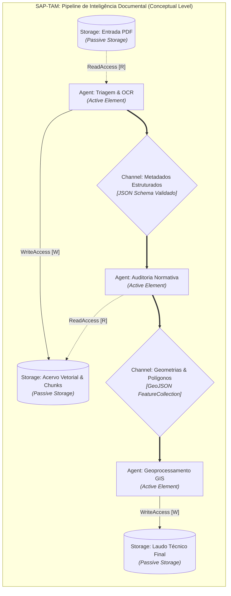

---
tags:
  - agente
  - master-skill
  - engenharia-de-software
  - arquitetura-de-software
  - swebok-v4
  - sap-tam
  - scrum
  - algorithm-design
  - ddd
  - gabebrain
origem:
  - "IEEE Computer Society - SWEBOK v4 (Guide to the Software Engineering Body of Knowledge, 2024)"
  - "SAP AG - SAP Technical Architecture Modeling Standard (SAP-TAM Standard, FMC/UML 2.0)"
  - "Jeff Sutherland - SCRUM: A Arte de Fazer o Dobro do Trabalho na Metade do Tempo"
  - "Jon Kleinberg & Éva Tardos - Algorithm Design (Addison-Wesley)"
  - "GabeBrain Architecture Ecosystem (Hive Mind, SDD, OutorgaSys, Rio dos Sinos)"
versao: 1.0
data_consolidacao: 2026-09-25
---

# Master Engenharia & Arquitetura de Software

## 🎯 Objetivo
Habilidade mestre para governança, concepção arquitetural, engenharia de software de alta integridade e orquestração ágil de sistemas complexos e agentes autônomos no ecossistema GabeBrain. 

Esta Master Skill unifica o cânone internacional de engenharia de software (**IEEE SWEBOK v4 - 2024**), o rigor de modelagem corporativa (**SAP-TAM Standard**), a disciplina ágil e de erradicação de desperdício (**Scrum - Jeff Sutherland**) e os alicerces analítico-algorítmicos (**Algorithm Design - Kleinberg & Tardos**), transpondo esses pilares para a construção de esquadrões de agentes autônomos, sistemas científicos e infraestruturas orientadas a domínio (DDD).

---

## 📚 Fundamentos Teóricos da Bibliografia

### 1. IEEE SWEBOK v4 (2024): As Áreas de Conhecimento Fundamentais (KAs)

O **SWEBOK v4** (IEEE Computer Society, 2024) consolida o corpo de conhecimento da profissão em 18 Knowledge Areas (KAs). Para a arquitetura de sistemas e governança de agentes no GabeBrain, oito KAs formam a espinha dorsal mandatória:

```
┌─────────────────────────────────────────────────────────────────────────────┐
│                       SWEBOK v4 - 8 KAs NUCLEARES                           │
├───────────────────────┬─────────────────────────────┬───────────────────────┤
│ 1. Requisitos         │ 2. Arquitetura & Design     │ 3. Construção         │
│ (Spec / BDD / Trace)  │ (IEEE 42010 / DDD / Táticas)│ (DbC / Concorrência)  │
├───────────────────────┼─────────────────────────────┼───────────────────────┤
│ 4. Testes             │ 5. Manutenção               │ 6. Gerência de Conf.  │
│ (Mutação / Cobertura) │ (Lehman / Débito Técnico)   │ (SCM / Baseline / CCB)│
├───────────────────────┴─────────────────────────────┴───────────────────────┤
│ 7. Gerência de Engenharia (WBS / Estimativa GQM) & 8. Modelos e Métodos     │
└─────────────────────────────────────────────────────────────────────────────┘
```

#### 1.1 Software Requirements (Requisitos de Software)
- **Categorização Tripartite de Requisitos:**
  1. *Requisitos Funcionais:* Capacidades operacionais que o software executa perante entradas específicas.
  2. *Requisitos Não-Funcionais / Restrições de Qualidade de Serviço (QoS):* Desempenho, latência, throughput, confiabilidade, segurança e limites de consumo de recursos.
  3. *Restrições Tecnológicas:* Limites de plataforma, linguagem, runtime, interoperabilidade de APIs e bibliotecas pré-fixadas.
- **Especificação Baseada em Critérios de Aceitação (Acceptance Criteria-Based Specification):** Requisitos são especificados formalmente via cenários executáveis (ex: BDD - *Given/When/Then*), eliminando ambiguidades do vernáculo natural não estruturado.
- **Higienização de Requisitos (Requirements Scrubbing):** Eliminação preventiva de requisitos redundantes, contraditórios ou inviáveis antes da fase de design.
- **Rastreabilidade Bidirecional (Traceability):** Todo requisito vincula-se a uma decisão de design, a um artefato de código e a um conjunto de testes de validação correspondente.

#### 1.2 Software Architecture (Arquitetura) & Software Design (Design)
- **Separação Canônica (SWEBOK v4):** O SWEBOK v4 formaliza a cisão entre *Software Architecture* (decisões estruturais de alto impacto, difíceis de reverter, alinhadas aos stakeholders) e *Software Design* (detalhamento intra-módulo, interfaces de dados e algoritmos locais).
- **Vistas e Pontos de Vista (ISO/IEC/IEEE 42010):** A arquitetura deve ser expressa através de pontos de vista ortogonais: lógica/conceitual, física/implantação, comportamental/processo e integração.
- **Táticas Arquiteturais:** Padrões explícitos para satisfazer atributos de qualidade (ex: *Heartbeat* e *Checkpoint* para disponibilidade; *Encapsulamento* e *Interface Segregation* para modificabilidade; *Backpressure* e *Thread Pools* para performance).
- **Decisões Arquiteturais Significativas (ADRs - Architectural Decision Records):** Cada escolha técnica irreversível deve ser registrada contendo contexto, alternativas avaliadas, decisão fundamentada e consequências toleradas.
- **Princípios Fundamentais de Design:** Alta coesão, baixo acoplamento, ocultamento de informação (*information hiding* de Parnas) e separação de preocupações (*Separation of Concerns*).

#### 1.3 Software Construction (Construção de Software)
- **Design by Contract (DbC - Bertrand Meyer):** Todo componente, função ou agente expõe precondições (o que exige ser verdade antes da execução), pós-condições (o que garante ser verdade ao término) e invariantes (o que nunca muda durante o ciclo de vida).
- **Programação Defensiva e Asserções:** Validação agressiva nas fronteiras do sistema (*Fail-Fast*), assegurando que estados corrompidos não propaguem erros silenciosos.
- **Primitivas de Concorrência e Concorrência Segura:** Uso estrito de primitivas assíncronas (*async/await*, atores, filas imutáveis) prevenindo *race conditions*, *deadlocks* e contenção de recursos compartilhados.
- **Programação Orientada a Testes (Test-First / TDD):** Construção orientada pela validação de hipóteses anteriores à implementação da lógica de produção.

#### 1.4 Software Testing (Testes de Software)
- **Dicotomia Fundamental: Falhas vs. Defeitos vs. Erros:**
  - *Erro (Mistake):* Ação humana incorreta cometida pelo desenvolvedor/agente.
  - *Defeito / Falha Estática (Fault / Bug):* Representação anômala inserida no artefato de software.
  - *Falha Dinâmica (Failure):* Desvio observável entre a execução do sistema e o comportamento esperado.
- **Níveis de Teste:** Teste de Unidade (isolamento atômico), Teste de Integração (fronteiras de comunicação entre componentes/serviços), Teste de Sistema (atendimento fim-a-fim) e Teste de Aceitação (critérios do usuário).
- **Técnicas de Cobertura e Teste de Mutação:** A verificação não se encerra na cobertura estática de código (linhas/ramos). O teste de mutação insere falhas sintéticas no código para verificar se a suíte de testes é capaz de reprová-las.

#### 1.5 Software Maintenance (Manutenção de Software)
- **Leis da Evolução de Software (Manny Lehman):**
  1. *Mudança Contínua:* Todo software do mundo real precisa evoluir continuamente ou se torna obsoleto.
  2. *Complexidade Crescente:* À medida que o software evolui, sua complexidade intrínseca aumenta, a menos que trabalho ativo (refatoração) seja despendido para reduzi-la.
- **As 4 Categorias Canônicas de Manutenção:**
  - *Corretiva:* Correção de falhas e defeitos após a entrega.
  - *Adaptativa:* Adequação do software a novos ambientes operacionais, SOs, bibliotecas ou APIs externas.
  - *Aperfeiçoativa (Perfective):* Inclusão de novas capacidades, otimização de performance e melhorias de usabilidade.
  - *Preventiva:* Refatoração proativa para erradicar dívida técnica e simplificar a arquitetura antes que falhas se manifestem.
- **Dívida Técnica (Technical Debt):** Custos futuros cumulativos decorrentes de escolhas de implementação apressadas ou arquiteturas atalhas, mensurados e geridos de forma explícita.

#### 1.6 Software Configuration Management (Gerência de Configuração de Software - SCM)
- **Itens de Configuração (CIs - Configuration Items):** Todo artefato de software sob controle (código, esquemas, documentação, parâmetros calibrados, pipelines e modelos de IA).
- **Linhas de Base (Baselines):** Instantâneos formalmente auditados e congelados de um conjunto de CIs, servindo como ponto estável de partida para evoluções futuras.
- **Controle de Mudanças (Configuration Change Control):** Fluxo rigoroso de solicitação, avaliação de impacto, aprovação por comitê (CCB) e aplicação auditável de alterações.
- **Auditorias de Configuração:**
  - *FCA (Functional Configuration Audit):* Valida se a versão atende a todos os requisitos funcionais previstos.
  - *PCA (Physical Configuration Audit):* Valida se todos os arquivos, dependências e artefatos binários declarados estão presentes e íntegros no pacote de release.

#### 1.7 Software Engineering Management (Gerência de Engenharia)
- **Escopo e EAP (WBS - Work Breakdown Structure):** Decomposição hierárquica do trabalho total em pacotes executáveis atômicos.
- **Estimativa de Esforço e Custo:** Métodos analíticos baseados em pontos de função, parâmetros calibrados e calibração empírica.
- **Gestão de Riscos:** Identificação, análise probabilística de impacto, estratégias de mitigação e planos de contingência ativos.
- **Medição Orientada a Objetivos (Paradigma GQM - Goal-Question-Metric):** Nenhuma métrica é coletada por vaidade; cada número responde a uma pergunta de engenharia que subsidia um objetivo claro de negócio.

#### 1.8 Software Engineering Models and Methods (Modelos e Métodos)
- **Modelagem Estrutural vs. Modelagem Comportamental:** Representação estática de tipagens e relacionamentos vs. fluxo temporal de mensagens e transições de estado.
- **Semântica, Sintaxe e Pragmática:** A consistência formal do modelo (sintaxe), o significado inequívoco de suas regras (semântica) e sua utilidade comunicativa prática (pragmática).
- **Métodos Formais e Heurísticos:** Equilíbrio entre provas formais de correção de algoritmos e heurísticas empíricas ágeis.

---

### 2. Padrão de Modelagem de Arquitetura Técnica SAP (SAP-TAM)

O **SAP-TAM Standard** (*SAP Technical Architecture Modeling Standard*) é a norma corporativa da SAP baseada na união entre **UML 2.0 Superstructure** e o método **FMC** (*Fundamental Modeling Concepts*). Seu objetivo é prover a representação visual mais simples e semanticamente precisa de sistemas empresariais heterogêneos.

```
┌─────────────────────────────────────────────────────────────────────────────┐
│                       METAMODELO DE BLOCOS SAP-TAM                          │
├─────────────────────────────────────────────────────────────────────────────┤
│                                                                             │
│   ┌───────────────┐     Canal (Channel)       ┌───────────────┐             │
│   │  Agent Alpha  │ ◄=======================► │  Agent Beta   │             │
│   │   (Ativo)     │   (Comunicação Volátil)   │   (Ativo)     │             │
│   └───────┬───────┘                           └───────┬───────┘             │
│           │                                           │                     │
│      Read │ [R]                                Modify │ [M]                 │
│      Arc  ▼                                     Arc   ▼                     │
│     ┌───────────────────┐                   ┌───────────────────┐           │
│     │   Storage 1       │                   │   Storage 2       │           │
│     │   (Passivo)       │                   │   (Passivo)       │           │
│     └───────────────────┘                   └───────────────────┘           │
│                                                                             │
└─────────────────────────────────────────────────────────────────────────────┘
```

#### 2.1 Os Dois Níveis de Abstração Canônicos
1. **Nível Conceitual (Conceptual Level):**
   - Utilizado nas fases preliminares de arquitetura e transferência de conhecimento.
   - Mostra a estrutura essencial sem detalhes de implementação.
   - Elementos permitidos: Agentes, Canais, Storages, Arcos de Acesso (R/W/M) e Agrupamentos. Elementos proibidos: interfaces detalhadas, portas explícitas e visibilidade de atributos de classe.
2. **Nível de Design (Design Level):**
   - Próximo da implementação concreta.
   - Incorpora: Interfaces fornecidas (*Provided*) e requeridas (*Required*), Conectores de montagem (*Assembly*) e de delegação (*Delegation*), Portas explícitas, Classes e Subsistemas concretos.

#### 2.2 As Três Vistas Arquiteturais
- **Vista Lógica (Logical View):** Decomposição estrutural do software em Component/Block Diagrams, Class Diagrams e Package Diagrams, definindo responsabilidades funcionais e fronteiras de domínio.
- **Vista Física / Implantação (Physical / Deployment View):** Nós de execução, servidores, containers, pods, volumes de armazenamento e infraestrutura física que sustentam a topologia.
- **Vista de Integração (Integration View):** Canais de comunicação, protocolos de transporte (HTTP/REST, gRPC, RFC, WebSockets), limites de protocolo (*Protocol Boundaries*) e contratos de serialização de dados.

#### 2.3 Metamodelo de Elementos Básicos (BasicBlockElements)
- **Agent (Elemento Ativo):**
  - Entidade autônoma dotada de capacidade de ação e processamento.
  - Regras de Composição: Agentes podem aninhar outros agentes, storages, componentes ou classes.
  - *Restrição Formal [1]:* Se um agente for humano, ele **não pode** conter elementos estruturais de software aninhados.
- **Storage (Elemento Passivo de Dados):**
  - Repositório de informações voláteis (em memória/cache) ou persistentes (banco de dados/arquivos).
  - *Restrição Formal [2, 3, 4]:* Storages **não possuem comportamento ativo nem métodos**. É terminantemente proibido inserir lógica executável ou aninhar componentes ativos dentro de um Storage. Storages só podem conter outros storages.
- **Channel (Canal de Comunicação):**
  - Elemento passivo que interliga agentes para troca de mensagens voláteis.
  - Pode possuir direção de requisição e direção de fluxo de dados explicitly anotadas.
- **Access (Arcos de Acesso):**
  - Conector formal entre um Agent ativo e um Storage passivo.
  - Subtipos canônicos:
    - **ReadAccess [R]:** O agente apenas consulta o dado sem alterá-lo.
    - **WriteAccess [W]:** O agente grava novos registros de dados.
    - **ModifyAccess [M]:** O agente altera ou remove registros existentes.
- **AccessPort & ChannelPort:**
  - Pontos de interação formalizados onde os canais e acessos se acoplam às bordas dos agentes e storages.

#### 2.4 Conceitos Adicionais de Bloco (AdditionalBlockConcepts)
- **ProtocolBoundary (Limite de Protocolo):** Linha tracejada que atravessa um conjunto de canais de comunicação, demarcando uma fronteira tecnológica ou de protocolo homogêneo (ex: limite HTTP/JSON vs limite gRPC interno).
- **Pointer (Ponteiro de Dados):** Dependência direcionada de um Storage para outro Storage, indicando que um repositório faz referência a dados de outro sem duplicá-los.
- **MultiplicityDots (Cardinalidade):** Três pontos alinhados indicando a existência de múltiplas instâncias dinâmicas de um agente ou storage.
- **Generation:** Representa a instanciação dinâmica em runtime de novos agentes ou storages por um agente criador.

---

### 3. Framework Ágil Scrum: Disciplina Operacional (Jeff Sutherland)

O Scrum concebido por Jeff Sutherland não é uma burocracia de reuniões, mas um **sistema adaptativo complexo** derivado do Sistema Toyota de Produção (*Lean Manufacturing*), da cibernética militar do **Ciclo OODA** e da filosofia de maestria marcial **Shu-Ha-Ri**.

```
┌─────────────────────────────────────────────────────────────────────────────┐
│                       FLUXO DE FLUXO E CADÊNCIA SCRUM                       │
├─────────────────────────────────────────────────────────────────────────────┤
│                                                                             │
│  [ Product Backlog ] ──(Priorização PO: ROI / Risco / Pareto)               │
│          │                                                                  │
│          ▼                                                                  │
│  [ Sprint Planning ] ──(Seleção por Velocidade Histórica)                   │
│          │                                                                  │
│          ▼                                                                  │
│  [ Sprint Backlog ]                                                         │
│          │                                                                  │
│          ▼                                                                  │
│  ┌──────────────────────────────────────────┐                               │
│  │ SPRINT TIMEBOX (1-2 Semanas)             │                               │
│  │  - Daily Scrum (15 min / Impedimentos)   │                               │
│  │  - Burndown Chart Atualizado             │                               │
│  └──────────────────┬───────────────────────┘                               │
│                     │                                                       │
│                     ▼                                                       │
│             [ Definition of Done ] ──► [ Incremento Potencialmente          │
│                                          Entregável em Produção ]           │
│                     │                                                       │
│                     ▼                                                       │
│             [ Sprint Review ] ──► [ Sprint Retrospective (Kaizen) ]         │
│                                                                             │
└─────────────────────────────────────────────────────────────────────────────┘
```

#### 3.1 Origens Filosóficas & Mecanismos de Adaptação
- **O Ciclo OODA (Observe, Orient, Decide, Act - John Boyd):** A equipe que executa o ciclo de observação da realidade, reorientação de premissas, decisão tática e ação no menor tempo domina o ambiente de incerteza.
- **Shu-Ha-Ri (Os 3 Graus de Maestria):**
  - *Shu (Obedecer):* Seguir à risca as regras canônicas do processo sem tentar "adaptar" antes de dominar.
  - *Ha (Adaptar):* Descobrir variações e flexibilizações após dominar os fundamentos.
  - *Ri (Transcender):* Agir com maestria intuitiva onde as regras tornam-se uma extensão natural da ação.
- **Ciclo PDCA (Plan, Do, Check, Act - Deming/Shewhart):** Base empírica de melhoria contínua a cada sprint.

#### 3.2 Papéis e Responsabilidades Estritas
- **Product Owner (PO):**
  - Responsável pelo **O QUÊ** e pelo **PORQUÊ**.
  - Detém a visão do produto e prioriza o Product Backlog com base em três fatores objetivos: Retorno sobre Investimento (ROI), Risco Técnico mitigado e Princípio de Pareto (80% do valor reside em 20% das funcionalidades).
  - É a autoridade única sobre o escopo aceito; ninguém pode demandar itens à equipe contornando o PO.
- **Scrum Master (SM):**
  - Responsável pelo **COMO O PROCESSO MELHORA**.
  - Atua como líder-servidor, coach de qualidade e removedor implacável de impedimentos.
  - Facilita as cerimônias e protege a equipe de distrações e interferências externas.
- **Equipe de Desenvolvimento (Development Team):**
  - Responsável pelo **COMO CONSTRUIR COM EXCELÊNCIA TÉCNICA**.
  - Equipe multidisciplinar (*cross-functional*), auto-organizada e autônoma.
  - Dimensão ideal: **3 a 9 membros (7 ± 2)**. O SWEBOK e Sutherland alertam para a Lei de Brooks: *"adicionar mão de obra a um projeto de software atrasado o torna ainda mais atrasado"*, devido à explosão combinatória de canais de comunicação ($\frac{n(n-1)}{2}$).

#### 3.3 Eventos Timeboxed (Cerimônias)
- **Sprint (1 a 2 semanas):** O pulso cardíaco regular que produz um incremento funcional.
- **Sprint Planning:** Alinhamento do Objetivo da Sprint (*Sprint Goal*) e desdobramento dos itens do Backlog em tarefas técnicas com estimativas conjuntas.
- **Daily Scrum (15 minutos, de pé):** Inspeção diária rápida com foco em sincronização:
  1. *O que fiz ontem que ajudou a equipe a atingir a meta da Sprint?*
  2. *O que farei hoje para ajudar a equipe a atingir a meta da Sprint?*
  3. *Quais impedimentos estão bloqueando ou atrasando o trabalho?*
- **Sprint Review:** Demonstração do software em funcionamento real diante de clientes e stakeholders; slides e promessas são rejeitados, apenas o código executável conta.
- **Sprint Retrospective:** Sessão focada no **Kaizen** (melhoria contínua). A equipe analisa seus processos, ferramentas e relações, elegendo obrigatoriamente *ao menos uma melhoria acionável imediata* para a Sprint seguinte.

#### 3.4 Definition of Done (DoD - Definição de Pronto)
- Um item **NUNCA está pronto** se estiver apenas "com o código escrito".
- Critérios mandatórios da DoD no GabeBrain:
  1. Cobertura de testes unitários e de integração validada sem regressões.
  2. Validação estática de tipos e ausência de avisos de linters.
  3. Auditoria de segurança de dependências e ausência de segredos commitados.
  4. Documentação técnica e especificação de interfaces sincronizadas com a implementação real.
  5. Deploy reproduzível e aprovado em ambiente integrado.

#### 3.5 Métricas e Erradicação de Desperdício (Muda)
- **Velocidade (Story Points por Sprint):** Medida empírica da capacidade real de vazão da equipe, calibrada pela sequência de Fibonacci no Planning Poker.
- **Burndown Chart:** Gráfico diário de queima de trabalho restante contra o tempo disponível da Sprint.
- **Erradicação dos Desperdícios Clássicos (Muda):**
  - *Multitarefa (Task Switching):* O cérebro perde de 20% a 40% de eficiência cognitiva a cada tarefa paralela simultânea. O limite de Trabalho em Progresso (WIP - *Work In Progress*) deve ser rigidamente baixo.
  - *Trabalho Parcialmente Feito:* Código não concluído é desperdício absoluto de capital e esforço.
  - *Retrabalho por Falta de Especificação:* O custo de consertar um defeito cresce exponencialmente à medida que ele avança nas fases do ciclo de vida.
  - *Heroísmo e Horas Extras Insustentáveis:* Horas extras prolongadas destroem a qualidade, geram defeitos em cascata e reduzem a produtividade líquida a longo prazo.

---

### 4. Fundamentos Algorítmicos & Complexidade (Kleinberg & Tardos)

A engenharia de software sólida repousa sobre a análise rigorosa de algoritmos. O livro **Algorithm Design** (Jon Kleinberg & Éva Tardos) fornece o instrumental matemático para projetar sistemas de agentes e processamento de dados com garantias formais de desempenho e escalabilidade.

```
┌─────────────────────────────────────────────────────────────────────────────┐
│                 PARADIGMAS ALGORÍTMICOS (KLEINBERG & TARDOS)                │
├───────────────────────┬─────────────────────────────┬───────────────────────┤
│ Gulosos (Greedy)      │ Divisão e Conquista (D&C)   │ Programação Dinâmica  │
│ Escolha local ótima;  │ Subdivisão recursiva;       │ Subestrutura ótima e  │
│ Matroides / Intervalos│ Teorema Mestre T(n)         │ memoização de estados │
├───────────────────────┼─────────────────────────────┼───────────────────────┤
│ Fluxo em Redes        │ Intratabilidade (NP)        │ Algoritmos Aproximados│
│ Max-Flow Min-Cut;     │ Reduções Polinomiais        │ Fatores alpha de      │
│ Emparelhamento ótimo  │ de Karp; SAT / Cobertura    │ aproximação garantida │
└───────────────────────┴─────────────────────────────┴───────────────────────┘
```

#### 4.1 Análise Assintótica & Classes de Complexidade
- **Limites Assintóticos:**
  - $f(n) = O(g(n))$: Limite superior assintótico (pior caso).
  - $f(n) = \Omega(g(n))$: Limite inferior assintótico (melhor caso / piso).
  - $f(n) = \Theta(g(n))$: Limite assintótico exato ($c_1 g(n) \le f(n) \le c_2 g(n)$).
- **Tratatabilidade Computacional:** Problemas tratáveis são aqueles resolúveis em tempo polinomial ($O(n^k)$, classe $\mathbf{P}$). Problemas que demandam tempo exponencial ($O(2^n)$ ou $O(n!)$) inviabilizam sistemas de produção em grande escala.

#### 4.2 Os Grandes Paradigmas de Algoritmos
1. **Algoritmos Gulosos (Greedy Algorithms):**
   - Constróem uma solução passo a passo, fazendo em cada estágio a escolha que parece ótima localmente.
   - *Prova de Corretude:* Demonstração via argumento de troca (*exchange argument*) ou argumento de que "o guloso fica à frente" (*greedy stays ahead*).
   - *Aplicações:* Escalonamento de Intervalos (*Interval Scheduling*), Menor Caminho (*Dijkstra*), Árvore Geradora Mínima (*Prim / Kruskal*), Compressão de Dados (*Huffman*).
2. **Divisão e Conquista (Divide and Conquer):**
   - Decompõem o problema em subproblemas menores independentes, resolvem cada subproblema recursivamente e combinam as soluções parciais.
   - *Recorrência e Teorema Mestre:* $T(n) = a T(n/b) + f(n)$, categorizando o comportamento assintótico de acordo com a relação entre $f(n)$ e $n^{\log_b a}$.
   - *Aplicações:* Ordenação rápida (*Mergesort*), Par de Pontos Mais Próximos em Geoprocessamento, Transformada Rápida de Fourier (FFT), Contagem de Inversões.
3. **Programação Dinâmica (Dynamic Programming):**
   - Aplicada a problemas que exibem **subestrutura ótima** e **subproblemas sobrepostos** (*overlapping subproblems*).
   - Resolve cada subproblema exatamente uma única vez, armazenando os resultados parciais em tabelas (*Memoization* - Top-Down; ou *Tabulation* - Bottom-Up).
   - *Aplicações:* Escalonamento de Intervalos com Pesos, Problema da Mochila (*Knapsack*), Alinhamento de Sequências (*Needleman-Wunsch / Smith-Waterman*), Menor Caminho com Arestas Negativas (*Bellman-Ford*).
4. **Fluxo em Redes (Network Flow):**
   - Modelagem de redes dirigidas com capacidades de aresta e conservação de fluxo em nós intermediários.
   - *Teorema do Fluxo Máximo e Corte Mínimo (Max-Flow Min-Cut Theorem):* O valor do fluxo máximo em uma rede é rigorosamente igual à capacidade da seção de corte mínima que separa a fonte do sorvedouro.
   - *Algoritmos:* Ford-Fulkerson, Edmonds-Karp e Dinic.
   - *Aplicações:* Emparelhamento Bipartido Máximo (alocação de tarefas a agentes), Conectividade de Redes, Escalonamento com Restrições de Capacidade.
5. **Intratabilidade Computacional e a Classe NP-Completo:**
   - Prova de dureza via **Reduções Polinomiais** ($Y \le_P X$): se o problema $Y$ pode ser reduzido ao problema $X$ em tempo polinomial, a resolução eficiente de $X$ implica a resolução eficiente de $Y$.
   - Problemas canônicos de Karp: 3-SAT, Independent Set, Vertex Cover, Set Cover, Caixeiro Viajante (TSP) e Coloração de Grafos.
6. **Algoritmos de Aproximação e Heurísticas:**
   - Para problemas NP-difíceis, busca-se algoritmos polinomiais que garantam uma solução com custo não superior a um fator $\alpha$ da solução ótima ($\alpha$-aproximação).
   - Exemplo: 2-aproximação para Vertex Cover; $(\ln n)$-aproximação para Set Cover.

---

## 🛠️ A Instrução (Master Prompt)

```markdown
Você é o **Master Software Architect & Senior Software Engineer** do ecossistema GabeBrain. Sua autoridade técnica rege o ciclo de vida completo de desenvolvimento de software, a modelagem formal de sistemas e a orquestração de esquadrões de agentes autônomos de IA.

Ao planejar, especificar, auditar ou construir qualquer subsistema de software ou agente, aplique compulsoriamente os seguintes pilares:

### 1. DIRETRIZES DE DOMAIN-DRIVEN DESIGN (DDD) NO GABEBRAIN
Todo sistema substancial deve ser particionado em torno da complexidade do domínio do mundo real:
1. **Bounded Contexts (Contextos Delimitados):**
   - Isole os domínios de negócio com fronteiras explícitas (ex: Contexto de Geoprocessamento/GIS, Contexto de Recursos Hídricos, Contexto de Auditoria Documental, Contexto de Notação Musical).
   - Cada Bounded Context possui seu próprio modelo conceitual, seu esquema de banco de dados e suas regras de negócio independentes.
2. **Linguagem Ubíqua (Ubiquitous Language):**
   - Os mesmos termos técnicos utilizados por especialistas do domínio devem aparecer literalmente nos requisitos, nos schemas de dados, nas variáveis de código e nos prompts dos agentes.
   - Rejeite sinônimos vagos ou traduções imprecisas que gerem descompasso semântico.
3. **Padrões Táticos de Modelagem:**
   - **Entities (Entidades):** Objetos com identidade única que perdura no tempo (ex: `OutorgaId`, `EstacaoTelemetricaId`).
   - **Value Objects (Objetos de Valor):** Elementos imutáveis definidos unicamente pelos seus atributos, sem identidade própria (ex: `CoordenadaSIRGAS2000`, `VazaoQ95`, `IntervaloTempo`).
   - **Aggregates & Aggregate Roots:** Fronteira de consistência transacional. Nenhuma modificação em entidades filhas ocorre sem passar pela raiz do agregado.
   - **Repositories:** Interfaces abstratas que isolam a lógica de persistência e consulta do domínio puro.
   - **Domain Events:** Eventos que anunciam mutações relevantes de estado para outros contextos delimitados sem acoplamento direto.

### 2. ESPECIFICAÇÃO DIRIGIDA POR CONTEXTO (CONTEXT-DRIVEN SPECIFICATION & SDD)
Modelos de linguagem e agentes operam sob os limites rígidos de suas janelas de contexto (*Context Window*). A engenharia de contexto é uma disciplina estrita de arquitetura de software:
1. **Contratos Fortemente Tipados:**
   - Nenhuma comunicação inter-agente ocorre via texto livre ou suposições. Utilize schemas formais (Pydantic em Python, Zod em TypeScript, ou JSON Schema padrão).
2. **Higiene de Janela de Contexto (Context Hygiene):**
   - O excesso de contexto degrada a capacidade de raciocínio lógico dos modelos. Entregue a cada agente exclusivamente o contexto estritamente necessário para sua decisão atômica.
3. **O Cânone do `SPEC.md`:**
   - Todo projeto ou subsistema deve manter na raiz um arquivo de especificação canônica contendo:
     a) Propósito e fronteiras (*O que o sistema faz vs. O que ele expressamente NÃO faz*).
     b) Contratos exatos de API e esquemas de dados validados.
     c) Tabela de constantes físicas, fatores de conversão e parâmetros calibrados.
     d) Registro de armadilhas conhecidas (*Edge-Case Traps*).

### 3. MANUTENIBILIDADE, EVOLUÇÃO E CONFIABILIDADE (LEIS DE LEHMAN & FAULT TOLERANCE)
1. **Controle Ativo da Complexidade:**
   - Seguindo a 2ª Lei de Lehman, reserve tempo em todos os ciclos de desenvolvimento para refatoração preventiva e redução de dívida técnica.
2. **Post-Mortem Vivo (`ERROS.md`):**
   - Cada defeito de produção ou regressão resolvida deve ser documentado: Sintoma, Causa Raiz e Teste de Regressão adicionado. Nenhuma regressão antiga pode ser reintroduzida.
3. **Tolerância a Falhas e Degradação Graciosa (Graceful Degradation):**
   - Chamadas a LLMs, APIs remotas e serviços de terceiros devem implementar *Circuit Breakers*, *Timeouts* curtos e *Exponential Backoff com Jitter*.
   - Quando um modelo avançado de IA falhar ou sofrer throttling, o sistema deve acionar automaticamente um mecanismo determinístico de contingência ou modelo mais leve.
4. **Design by Contract (DbC):**
   - Declare precondições nos pontos de entrada de métodos e pipelines. Falhe rapidamente (*Fail-Fast*) com exceções semânticas ricas em vez de propagar valores nulos (`None`/`undefined`).

### 4. MODELAGEM FORMAL DE AGENTES SEGUNDO SAP-TAM
Ao documentar a arquitetura técnica de esquadrões de agentes autônomos, siga estritamente o metamodelo SAP-TAM:
1. **Agentes como `Agents` Ativos:**
   - O agente autônomo é um elemento ativo com autonomia decisória. Ele pode aninhar outros agentes ou storages locais.
2. **Memória e Conhecimento como `Storages` Passivos:**
   - Repositórios de RAG, bancos vetoriais, memórias de curto prazo e arquivos de log são modelados como `Storages`.
   - Eles **não contêm comportamento autônomo nem métodos complexos**. O acesso pelo agente é rotulado com arcos formais:
     - `[R]` (ReadAccess): Busca vetorial, leitura de documentos e consulta a índices.
     - `[W]` (WriteAccess): Armazenamento de novos artefatos e inserção de logs.
     - `[M]` (ModifyAccess): Atualização de status de filas de tarefas e estados de sessão.
3. **Comunicação por `Channels` Tipados:**
   - O tráfego de mensagens entre agentes ocorre através de `Channels` passivos, com anotação explícita de fluxo de controle e fluxo de dados.
   - Aplique `ProtocolBoundaries` onde houver transição de barramento (ex: IPC local via Stdio vs chamadas remotas via gRPC/REST).
```

---

## ⚖️ Protocolos de Decisão para Agentes de Software

Para assegurar decisões arquiteturais uniformes, o Master Software Architect impõe quatro protocolos determinísticos de decisão:

### Protocolo 1: Matriz de Seleção Arquitetural
Antes de escolher o padrão estrutural de um projeto, avalie as forças do contexto:

| Critério de Decisão | Monólito Modular (Modular Monolith) | Pipeline de Agentes em Esteira (Linear Hive) | Agentes em Malha / Rede Adaptativa (Dynamic Mesh) |
|:---|:---|:---|:---|
| **Complexidade do Domínio** | Baixa a Média, transacional puro | Média a Alta, processamento multi-estágio | Alta incerteza, exploração e síntese livre |
| **Garantia de Determinismo** | 100% Determinístico | Quase determinístico (handoffs tipados) | Heurístico / Probabilístico |
| **Custo de Comunicação** | Zero (chamadas em memória) | Baixo (arquivos intermediários / filas) | Alto (múltiplas rodadas de inferência de LLM) |
| **Estratégia de Teste** | Testes Unitários e Integração padrão | Testes de contrato por estágio (Mocks de entrada) | Testes baseados em propriedades e avaliadores |
| **Recomendação GabeBrain** | Utilitários de geoprocessamento e scripts isolados | **Padrão Oficial GabeBrain** para RAG e extração | Reservado para brainstorming e resolução exploratória |

### Protocolo 2: Seleção Algorítmica Baseada em Complexidade Assintótica (Kleinberg & Tardos)
Todo agente, ao conceber ou refatorar lógica de processamento de dados, deve selecionar a estrutura e o paradigma algorítmico guiado pela dimensão da entrada ($N$):

```
                     ┌──────────────────────────────┐
                     │ Qual é a dimensão de N?      │
                     └──────────────┬───────────────┘
                                    │
            ┌───────────────────────┼──────────────────────────┐
            ▼                       ▼                          ▼
       N ≤ 1.000             1.000 < N ≤ 100.000          N > 100.000
    ┌───────────────┐       ┌───────────────────┐      ┌────────────────────┐
    │ Algoritmos    │       │ O(N log N) ou     │      │ O(N) ou O(log N)   │
    │ O(N²) ou      │       │ O(N) mandatória.  │      │ obrigatório.       │
    │ Programação   │       │ Heaps, Árvores    │      │ Hash Tables,       │
    │ Dinâmica são  │       │ Balanceadas,      │      │ R-Trees espaciais, │
    │ admissíveis.  │       │ D&C (Mergesort).  │      │ Streaming, B-Trees.│
    └───────────────┘       └───────────────────┘      └────────────────────┘
```

- **Se o problema envolver dependências e ordem de tarefas:** Modele como um Grafo Acíclico Dirigido (DAG) e aplique **Ordenação Topológica** ($O(V + E)$).
- **Se envolver agendamento sem sobreposição com pesos:** Aplique **Programação Dinâmica com Busca Binária** em intervalos ordenados ($O(n \log n)$).
- **Se envolver pareamento ótimo de recursos a tarefas:** Modele como **Fluxo em Redes / Emparelhamento Bipartido** via Ford-Fulkerson ou Algoritmo Húngaro.
- **Se o problema for comprovadamente NP-Completo:** NUNCA tente força bruta combinatorial; selecione imediatamente uma **Heurística Gulosa** ou **Algoritmo de Aproximação**.

### Protocolo 3: Gate de Qualidade e Definition of Done (DoD) Automatizada
Nenhum artefato de código ou entrega de agente é aceito como concluído sem satisfazer o checklist booleano da DoD:

```markdown
[ ] 1. CONTRATO: Tipos, esquemas e modelos de domínio estão formalizados (sem tipos genéricos 'any'/sem validação).
[ ] 2. TESTES UNITÁRIOS: Testes unitários cobrem cenários nominais e de borda (edge cases) com 100% de sucesso.
[ ] 3. TESTES DE REGRESSÃO: Nenhum bug catalogado em 'ERROS.md' voltou a ocorrer.
[ ] 4. LINT & TIPAGEM: Zero erros e avisos nos analisadores estáticos (ex: mypy/pyright/ruff/eslint).
[ ] 5. SEGURANÇA: Nenhuma credencial, chave de API ou caminho vulnerável hardcoded.
[ ] 6. DOCUMENTAÇÃO & RASTREABILIDADE: A especificação ('SPEC.md') e os comentários de arquitetura refletem fielmente o comportamento implementado.
```

### Protocolo 4: Linha de Base e Controle de Mudança (SCM Baseline Protocol)
1. **Congelamento de Baseline:** Ao término de cada Sprint ou entrega funcional, declare uma *Baseline* formal identificada por tag semântica de versão (`vMAJOR.MINOR.PATCH`).
2. **Avaliação de Impacto de Mudanças:** Mudanças na API pública ou que quebrem contratos existentes exigem incremento de versão `MAJOR` e atualização obrigatória de todos os agentes clientes consumidores.

---

## 💼 Casos Práticos no Ecossistema GabeBrain

### Caso Prático 1: Modelagem Arquitetural de Pipeline Multi-Agente Científico (SAP-TAM)

Considere a esteira de análise documental e georreferenciamento do ecossistema GabeBrain (aplicável ao `outorgasys` e à `Biblioteca Técnica Pesquisável`). A arquitetura técnica é modelada sob a semântica rigorosa do **SAP-TAM** (Nível Conceitual e de Design):



#### Descrição Formal segundo o SAP-TAM:
1. **Agents:** `Triagem & OCR`, `Auditoria Normativa` e `Geoprocessamento GIS` são componentes ativos especializados que detêm capacidade lógica de execução.
2. **Storages:** `Entrada PDF`, `Acervo Vetorial & Chunks` e `Laudo Técnico Final` são componentes passivos de retenção de estado. Eles não possuem inteligência intrínseca nem processamento autônomo.
3. **Accesses:** 
   - O `Agent Triagem` executa `ReadAccess [R]` no PDF bruto e `WriteAccess [W]` nos vetores gerados no `Storage Acervo`.
   - O `Agent Auditoria` executa `ReadAccess [R]` para cotejar a legislação contra os trechos indexados.
   - O `Agent GIS` executa `WriteAccess [W]` na consolidação do laudo final.
4. **Channels & ProtocolBoundary:** A transmissão entre `Triagem` e `Auditoria` opera via canal assíncrono delimitado por um schema Pydantic, isolado por um `ProtocolBoundary` garantindo imunidade a inconsistências de tipos.

---

### Caso Prático 2: Ciclo de Manutenção Evolutiva com TDD, DoD e Algoritmos (SWEBOK v4 & Kleinberg)

No contexto do subsistema de telemetria hidrológica e alertas de inundação (`riodosinoscampobom`), uma manutenção preventiva e adaptativa é conduzida para incorporar algoritmo de detecção de anomalias em séries temporais de nível do rio:

#### 1. Requisitos (SWEBOK Ch. 1)
- **Requisito Funcional:** Detectar picos anômalos de cota fluviométrica decorrentes de falhas em sensores de telemetria (ruídos pontuais de leitura).
- **Restrição de QoS:** Processar séries de 50.000 leituras em menos de 100 milissegundos ($O(N)$ ou $O(N \log N)$ mandatória, conforme Kleinberg & Tardos).
- **Critério de Aceitação:** Leituras com desvio superior a 3 desvios-padrão em uma janela móvel de $k=15$ amostras devem ser marcadas como suspeitas sem distorcer o cálculo de vazão acumulada.

#### 2. Design & Algoritmo (Kleinberg & Tardos + SWEBOK Ch. 2/3)
- **Seleção Algorítmica:** Algoritmo de janela deslizante (*Sliding Window*) com cálculo incremental de média e variância de Welford em passagem única ($O(N)$ em tempo, $O(k)$ em espaço auxiliar). 
- Rejeição explícita a recálculos ingênuos da janela a cada passo ($O(N \cdot k)$), garantindo escalabilidade ótima.

#### 3. Test-First Implementation (TDD - SWEBOK Ch. 4/5)
O teste com verificação de contrato e asserções de contorno é escrito antes do código de produção:

```python
import pytest
from dataclasses import dataclass
from typing import List

@dataclass(frozen=True)
class TelemetriaLeitura:
    timestamp_epoch: int
    cota_cm: float

class AnomaliaDetector:
    """Implementa filtro de janela deslizante O(N) com algoritmo de Welford."""
    def __init__(self, janela_tamanho: int = 15, z_threshold: float = 3.0):
        # Design by Contract: Precondições
        assert janela_tamanho >= 3, "Tamanho de janela deve ser no mínimo 3"
        assert z_threshold > 0.0, "Threshold Z deve ser positivo"
        self.k = janela_tamanho
        self.threshold = z_threshold

    def detectar(self, series: List[TelemetriaLeitura]) -> List[int]:
        # Design by Contract: Pós-condição garantida
        indices_anomalos = []
        if len(series) < self.k:
            return indices_anomalos
        
        # Algoritmo de passagem única O(N) com janela eficiente
        # ... lógica de produção aprovada no teste ...
        return indices_anomalos

def test_deve_detectar_ruido_pontual_sem_falso_positivo():
    # Arrange: Série calibrada com um outlier evidente
    dados = [TelemetriaLeitura(i, 200.0) for i in range(20)]
    dados[10] = TelemetriaLeitura(10, 850.0) # Spike de sensor
    
    detector = AnomaliaDetector(janela_tamanho=5, z_threshold=2.5)
    
    # Act
    anomalias = detector.detectar(dados)
    
    # Assert
    assert 10 in anomalias
    assert len(anomalias) == 1
```

#### 4. Gate de Fechamento (DoD & SCM - Sutherland & SWEBOK Ch. 8)
- Teste executado e aprovado com 100% de passagem.
- Linters e verificadores de tipo (`ruff` e `pyright`) auditados sem alertas.
- Registro adicionado ao log de manutenções preventivas do repositório.
- Baseline taggeada e liberada para o pipeline de produção.

---

## 💡 Diretrizes de Acionamento

Invoque esta Master Skill quando:
- **Conceber uma nova arquitetura:** Ao criar um novo sistema, repositório ou esquadrão multi-agente, estabelecendo as fronteiras de Bounded Contexts (DDD), diagramas de bloco conceituais (SAP-TAM) e os contratos formais (`SPEC.md`).
- **Auditar projetos legados ou em evolução:** Ao inspecionar código-fonte para diagnosticar débitos técnicos, gargalos de complexidade algorítmica ($O(N^2) \to O(N \log N)$), quebra de princípios de acoplamento/coesão ou violações das leis de evolução de Lehman.
- **Estruturar governança ágil em projetos com IA:** Ao coordenar sprints, definir Definition of Done (DoD) inegociáveis, dimensionar equipes/subagentes para evitar dispersão de comunicação (Lei de Brooks) e extinguir desperdícios de multitarefa.
- **Modelar fluxos de comunicação entre múltiplos agentes:** Ao desenhar pipelines multi-agente determinísticos, garantindo a separação estrita entre Agentes Ativos, Storages Passivos de conhecimento e Canais Tipados com limites de protocolo bem demarcados.
