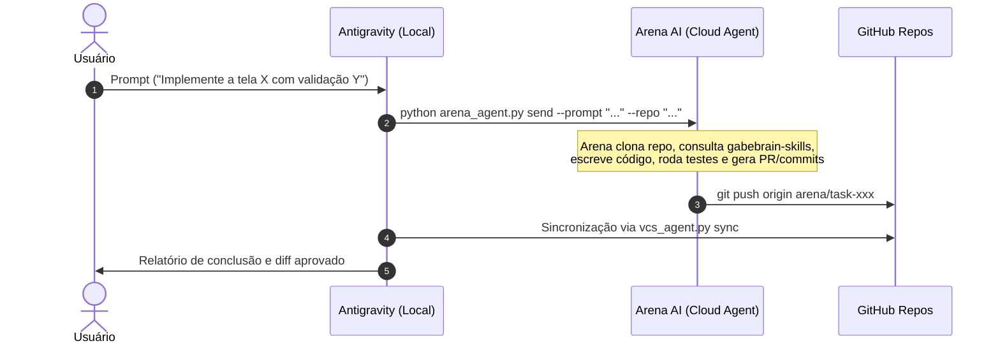
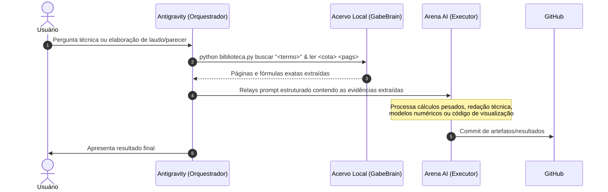

# Protocolo de Orquestração Híbrida: Antigravity <-> Arena AI

Este protocolo estabelece o fluxo de trabalho para delegar tarefas do **Antigravity** para o **Arena AI Agent**, garantindo máxima economia de tokens e aproveitamento ótimo de recursos de computação em nuvem.

---

## 🎯 Por Que Esta Arquitetura Existe?

1. **Economia de Tokens Locais no Antigravity:** 
   O Antigravity é excelente em raciocínio, orquestração e contexto de desenvolvimento local. No entanto, pipelines iterativas longas (geração de código extenso, execução e depuração de dezenas de testes, refatorações em larga escala) consomem limites de cota rapidamente.
2. **Computação e Automação Contínua na Arena AI:** 
   O agente da Arena AI opera em ambiente cloud isolado, com execução de shell, conexão direta ao GitHub e capacidade de rodar tarefas pesadas de forma autônoma sem consumir a cota de tokens do Antigravity.
3. **Ponte com o Conhecimento Local do GabeBrain:** 
   A Arena AI não tem acesso direto aos arquivos físicos no disco local (Google Drive, PDFs da Biblioteca Geológica, banco de dados local). O Antigravity atua como **Guardião e Orquestrador**, lendo os dados locais e enviando os dados essenciais mastigados para a Arena AI.

---

## 🔄 Fluxos de Execução

### Cenário A: Tarefa Geral / Desenvolvimento de Software / Análise de Código
*(Economia Máxima de Tokens)*



### Cenário B: Tarefa com Dependência da Biblioteca Local (Geologia, Docling, Fichas)
*(Orquestração Antigravity + Execução Arena)*



---

## 🛠️ Comandos de Integração (Antigravity -> Arena)

Para despachar comandos diretamente do terminal local ou via subagente Antigravity:

```bash
# 1. Enviar prompt para Arena conectado ao repositório do projeto
python "$HOME/.gemini/config/skills/arena-ai-controller/scripts/arena_agent.py" send \
  --prompt "Leia as diretrizes do gabebrain-skills e refatore o módulo de cálculo..." \
  --repo "gabrielhklaser/outorgasys" \
  --branch "main"

# 2. Reconciliar alterações feitas pelo Arena com o ambiente local
python "$HOME/.gemini/config/skills/vcs-version-agent/scripts/vcs_agent.py" sync
```
