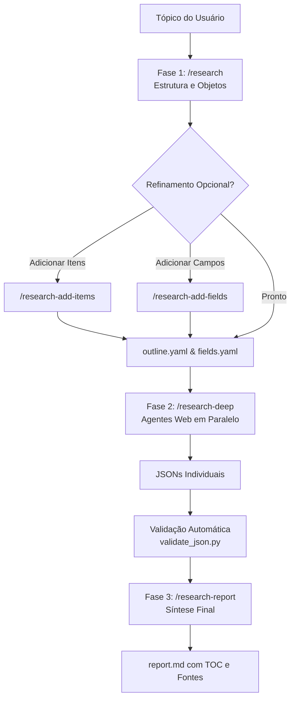

# Deep Research - Pesquisa Profunda Estruturada

Habilidade de pesquisa aprofundada para investigação acadêmica, comparação técnica de frameworks/ferramentas, inteligência de mercado, benchmark de IA e due diligence.

Inspirado no paper *RhinoInsight: Improving Deep Research through Control Mechanisms for Model Behavior and Context*.

---

## 🔄 Fluxo Operacional em 3 Fases



---

## 🛠️ Comandos e Sub-Skills Integradas

| Comando | Função Principal | Saída / Artefato |
|---|---|---|
| `/research <tópico>` | Constrói a estrutura inicial de pesquisa (objetos e matriz de campos) combinando conhecimento interno e busca web. | `{tópico}/outline.yaml`<br/>`{tópico}/fields.yaml` |
| `/research-add-items` | Acrescenta novos objetos/itens de pesquisa ao outline existente, prevenindo duplicatas. | Atualização in-place de `outline.yaml` |
| `/research-add-fields` | Adiciona novas dimensões/campos de análise com granularidade definida (`brief`, `moderate`, `detailed`). | Atualização in-place de `fields.yaml` |
| `/research-deep` | Conduz a investigação aprofundada disparando agentes paralelos para cada item, gerando JSON estruturado e validando cobertura. | `{output_dir}/{item_slug}.json` |
| `/research-report` | Sintetiza os achados em relatório Markdown completo com índice (TOC) ancorado, métricas comparativas e fontes. | `{tópico}/report.md` |

---

## 📋 Detalhamento das Fases

### Fase 1: Geração de Outline (`/research`)
1. **Model Baseline:** Gera os principais objetos do domínio e propõe campos analíticos recomendados.
2. **Confirmação Human-in-the-Loop:** Valida com o usuário a lista e a cobertura de campos.
3. **Suplementação Web:** Realiza buscas adicionais com janela temporal especificada (ex: últimos 6 meses, desde 2024, ilimitado).
4. **Exportação de Contratos:**
   - `outline.yaml`: Tópico, lista de itens e configurações de execução (`batch_size`, `items_per_agent`, `output_dir`).
   - `fields.yaml`: Categorias e definições de campos, níveis de detalhe e marcação de incertezas (`uncertain`).

### Fase 2: Pesquisa Profunda (`/research-deep`)
1. **Retomada Resiliente:** Verifica arquivos JSON já existentes no diretório de saída e pula itens concluídos.
2. **Execução em Lotes (Batches):** Processa itens em paralelo com agentes de busca especializados (`web-search-agent`).
3. **Validação Estrita de Esquema:**
   Após cada item ser extraído, executa a validação:
   ```bash
   python validate_json.py -f {topic}/fields.yaml -j {output_dir}/{item}.json
   ```
   Garante 100% de cobertura dos campos antes de considerar o item finalizado. Campos com dados insuficientes são rotulados com `[uncertain]`.

### Fase 3: Geração de Relatório (`/research-report`)
1. **Extração de Métricas de Destaque:** Mapeia campos numéricos ou curtos ideais para o Índice (ex: estrelas GitHub, ano, licença, valuation).
2. **Compilação Markdown:**
   - Sumário Executivo e Tabela de Conteúdos clicável.
   - Seções estruturadas por item e por categoria de campos.
   - Lista completa de fontes e referências consultadas.
