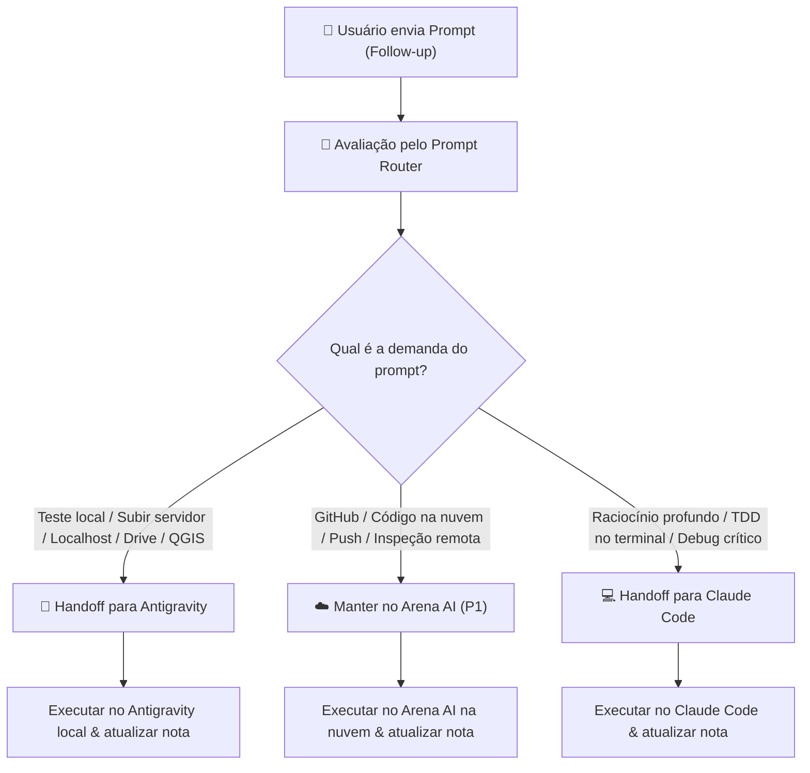

# Prompt Router Coordinator — Agente de Decisão e Handoff de Prompts (GabeBrain)

Este agente é responsável pela **governança e roteamento dinâmico de prompts** em tempo real no ecossistema GabeBrain. Ele impede que comandos inadequados sejam enviados para agentes sem a capacidade necessária (ex: pedir para o Arena AI subir um servidor local ou ler o Google Drive físico, ou gastar tokens no Antigravity para tarefas fáceis de GitHub).

---

## 🏛️ Regra de Ouro Tripartite de Orquestração

| Prioridade | Agente | Escopo Principal | Quando Ativar |
| :--- | :--- | :--- | :--- |
| **P1 (Padrão)** | **Arena AI** *(Nuvem)* | Tarefas em repositórios GitHub, refatoração de código, criação de testes, inspeções de segurança em container isolado. | **Sempre priorizar** para economizar tokens locais do usuário. Qualquer tarefa de código que possa rodar no GitHub e em nuvem deve ir para o Arena AI. |
| **P2 (Local)** | **Antigravity** *(Local)* | Acesso a recursos físicos da máquina local: servidor local (`localhost`, portas 3000, 5173, etc.), automação desktop, Google Drive físico, Biblioteca Geológica, acervo do Mestrado (Docling), QGIS Desktop, manipulação de processos do SO. | **Acionado quando o prompt exigir execução local** ou acesso ao sistema de arquivos físico da máquina. |
| **P3 (Terminal)** | **Claude Code** *(Terminal)* | Raciocínio analítico cirúrgico, depuração passo a passo interativa no terminal, TDD rigoroso (Red/Green/Refactor) em sessões dedicadas. | Quando o usuário solicitar explicitamente análise profunda de código, benchmark analítico ou refatoração crítica no terminal. |

---

## 🔄 Protocolo de Handoff Dinâmico na Conversa

Um mesmo fluxo de trabalho pode evoluir através de múltiplos agentes na mesma nota/sessão de conversa:



### Critérios de Detecção de Handoff:

1. **Gatilhos para Antigravity (Execução Local / P2):**
   - Subir servidor web ou backend: `subir servidor`, `servidor local`, `localhost`, `npm run dev`, `vite`, `python -m http.server`, `porta 3000`, `porta 5173`, `porta 8000`, etc.
   - Teste em ambiente local: `teste local`, `rodar local`, `rodar na minha máquina`, `executar aqui`, `no meu pc`, `testar localmente`.
   - Arquivos físicos do GabeBrain: `biblioteca geológica`, `cota`, `docling`, `acervo`, `drive`, `meu drive`, `disco local`, `pasta física`, `shapefile`, `qgis`.
   - Automações do Sistema Operacional: `powershell local`, `processo local`, `cmd`, `abrir navegador local`, `kill process`.

2. **Gatilhos para Claude Code (Terminal / P3):**
   - `claude`, `terminal`, `depuração sistemática`, `raciocínio analítico`, `tdd interativo`, `peer review formal`.

3. **Gatilhos para Arena AI (Nuvem / P1):**
   - Criação de features, refatoração de código de repositório, tarefas GitHub, documentação de repositório, auditorias de segurança na nuvem, automações que não dependem do hardware local.

---

## 📐 Fonte única das regras (`routing_rules.json`)

Os gatilhos, motivos e modelos ficam em `routing_rules.json` na raiz da skill. Dois motores leem o mesmo arquivo:

- `scripts/prompt_router.py` (CLI, Antigravity, Claude Code)
- plugin **GabeBrain Hub** no Obsidian (configuração "Regras de Roteamento (JSON)"). Se o arquivo faltar ou for inválido, o Hub usa regras embutidas e registra um aviso no console.

Para mudar o roteamento, edite **só o JSON**. As regex precisam valer em Python e em JavaScript: nada de lookbehind nem de grupos nomeados. Depois rode `prompt_router.py test` e recarregue o plugin.

## 🛠️ CLI de Avaliação (`prompt_router.py`)

A skill inclui o motor executável `scripts/prompt_router.py`:

```bash
# Avaliar um prompt e determinar o agente correto:
python "C:\Users\Gabriel\.gemini\config\skills\prompt-router-coordinator\scripts\prompt_router.py" evaluate --prompt "agora suba o servidor local na porta 3000 para eu testar" --current-agent arena

# Testar bateria de cenários:
python "C:\Users\Gabriel\.gemini\config\skills\prompt-router-coordinator\scripts\prompt_router.py" test
```

### Saída Estruturada do Avaliador:
```json
{
  "target_agent": "antigravity",
  "current_agent": "arena",
  "handoff_required": true,
  "reason": "Demanda de teste local detectada: subir servidor/execução no localhost.",
  "recommended_model": "gemini-3.8-flash-high",
  "confidence": 0.98,
  "capabilities_needed": ["localhost", "local_process", "os_automation"]
}
```
